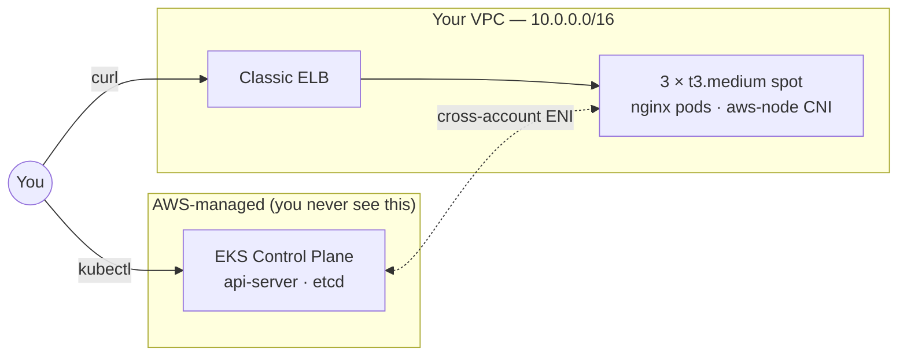

# Day 01 — EKS Cluster Setup

Provision a real EKS cluster **declaratively**, deploy nginx behind an ELB, tear it all down. No CLI-flag-driven cluster creation.

**Time:** ~75 min &nbsp;|&nbsp; **Cost:** ~$0.30 if cleaned up same day

---

## Architecture



The control plane lives in an AWS-owned VPC; cross-account ENIs in *your* subnets are how it reaches your workers. Pods get **real VPC IPs** from the `aws-node` CNI (no overlay network).

---

## Files

| File | Purpose |
|---|---|
| `eksctl-cluster.yaml` | Declarative cluster definition — VPC, nodegroup, IRSA, add-ons |
| `nginx-demo.yaml` | Deployment (2 replicas) + LoadBalancer Service |

---

## Implementation

### 1. Refresh AWS credentials (Salesforce SSO)

```bash
aws sso login --profile <your-sandbox-profile>
export AWS_PROFILE=<your-sandbox-profile>
aws sts get-caller-identity        # must show sandbox account, NOT root
```

### 2. Create the cluster (~15 min)

```bash
cd labs/day-01-eks-cluster-setup
eksctl create cluster -f eksctl-cluster.yaml
```

`eksctl` is a **CloudFormation orchestrator** — it generates and applies CFN stacks: cluster (VPC + control plane), nodegroup (Launch Template + ASG), add-ons. When it hangs, diagnose from the CloudFormation console, not from the eksctl CLI.

### 3. Verify

```bash
kubectl config current-context     # ends with @practice-cluster.us-west-2.eksctl.io
kubectl get nodes -o wide          # 3 Ready, all in private subnets
kubectl -n kube-system get pods    # coredns, aws-node, kube-proxy all Running

# Sanity-check the cluster
eksctl get cluster -r us-west-2    # ACTIVE
aws iam list-open-id-connect-providers   # OIDC provider exists → IRSA ready
```

### 4. Deploy the demo workload

```bash
kubectl apply -f nginx-demo.yaml
kubectl get deploy,svc,pods -l app=web

# Wait for the ELB to provision (~90–120s)
kubectl get svc web -w
```

### 5. Hit the LoadBalancer

```bash
ELB=$(kubectl get svc web -o jsonpath='{.status.loadBalancer.ingress[0].hostname}')
curl -sS "http://${ELB}/" | head -5      # returns the nginx welcome HTML
```

### 6. Teardown (always — avoid orphan ELBs and overnight cost)

```bash
bash ../../scripts/cleanup-day-01.sh
```

The cleanup script deletes the Service first (releases the ELB) before the cluster — order matters or you get orphan ELBs blocking VPC teardown.

---

## Common gotchas

| Symptom | Fix |
|---|---|
| `eksctl create cluster` hangs at "waiting for control plane" | Service quota: EIPs, VPCs, NAT GWs per region |
| Nodes stuck `NotReady` | Almost always `aws-node` CNI failure: `kubectl -n kube-system logs ds/aws-node` |
| Service `EXTERNAL-IP` stuck `<pending>` >5 min | Public subnets missing the `kubernetes.io/role/elb=1` tag (eksctl sets this; manual VPCs miss it) |
| `kubectl` returns `Unauthorized` | Your IAM identity isn't in the `aws-auth` ConfigMap. `eksctl create iamidentitymapping --cluster practice-cluster --arn <role-arn> --group system:masters` |

---

## Interview Q&A

### Q1. What does `eksctl create cluster` actually do under the hood?

`eksctl` is a CloudFormation orchestrator. It generates and applies stacks in order:

1. **Cluster stack** — VPC, subnets (2 public + 2 private across 2 AZs), IGW, NAT GW, route tables, cluster IAM role, cluster SG, and the EKS control plane itself.
2. **Nodegroup stack(s)** — node IAM role, instance profile, Launch Template, Auto Scaling Group, node SG.
3. **Add-on stacks** — `vpc-cni`, `coredns`, `kube-proxy`, `eks-pod-identity-agent`.

When `eksctl` hangs, diagnose from the CFN console — find the failed event, root-cause (usually a service quota, invalid CIDR, or missing IAM permission).

### Q2. Control plane vs data plane — what's the difference?

- **Control plane** — AWS-managed (api-server, etcd, scheduler, controller-manager). Runs in an AWS-owned VPC. $0.10/hr; you never see the EC2s.
- **Data plane** — your nodes, in your VPC, running your pods.

They communicate over **cross-account ENIs** — AWS injects ENIs into your subnets that the control plane uses to reach kubelets. Key property: **the data plane survives control plane outages** — existing pods keep serving traffic even when the API server is unreachable.

### Q3. How does authentication to an EKS cluster work?

Two layers:

1. **AuthN (who are you?)** — IAM. `kubectl` calls `aws eks get-token`, which returns a pre-signed STS `GetCallerIdentity` URL. The api-server validates it against IAM.
2. **AuthZ (what can you do?)** — historically the `aws-auth` ConfigMap maps IAM principal ARNs → Kubernetes groups → RBAC bindings.

The #1 `Unauthorized` cause: the cluster creator is in `aws-auth` automatically, but other identities need `eksctl create iamidentitymapping`.

Modern alternative: **EKS Access Entries** (2024) — managed API, no ConfigMap mutation, removes `aws-auth` from the failure path.

### Q4. How do pods get IP addresses in EKS?

The **VPC CNI plugin** (`aws-node` DaemonSet). Each node has primary + secondary ENIs; each ENI carries a pool of secondary IPs from the VPC CIDR. When a pod starts, the CNI allocates one IP to the pod's network namespace.

Implications:
- Pods get **real VPC IPs** — security groups apply, no NAT inside the VPC, direct routes to RDS/Lambda.
- IP density is bounded by `ENIs × IPs-per-ENI` (varies by instance type).
- Subnet CIDRs must be sized for pods, not just nodes — easy to exhaust in a `/24`.

For large clusters, enable **prefix delegation** — without it, an `m5.large` only gets ~29 pod IPs.

### Q5. Managed vs self-managed vs Fargate node groups — when to use each?

| Type | Use when | Trade-off |
|---|---|---|
| **Managed** | Default. Long-lived workloads. | AWS handles AMI patching, kubelet upgrades, graceful drain. |
| **Self-managed** | Custom AMIs, GPU, exotic networking. | You own upgrade choreography, ASG hooks, drain logic. |
| **Fargate** | Bursty / per-request workloads. Compliance ("no shared kernel"). | No DaemonSets, no privileged containers, slower cold-start, no GPUs. |

Common production pattern: managed nodegroups with **Spot for stateless burst** + **On-Demand for baselines**.

### Q6. What is IRSA and why does it matter?

**IAM Roles for Service Accounts** — the mechanism for giving a *pod* (not a node) AWS permissions.

How:
1. Cluster has an OIDC identity provider registered with IAM (`withOIDC: true`).
2. IAM role's trust policy allows a specific Kubernetes ServiceAccount via OIDC subject claim.
3. ServiceAccount annotated: `eks.amazonaws.com/role-arn: arn:aws:iam::...`.
4. Pod process gets temp creds via the SDK credential chain — no static keys, no node-role inheritance.

Without IRSA, the only way to give pods AWS perms is the node instance role — which means **every pod on that node** inherits them. Violates least privilege at the pod level. IRSA is non-negotiable for real clusters.

Newer alternative: **EKS Pod Identity** (2023) — same goal, no OIDC dependency, configured via EKS API instead of IAM trust policies.

### Q7. What's a `LoadBalancer` Service actually doing?

The cloud-provider (in-tree or AWS Load Balancer Controller) sees the `LoadBalancer` Service and:
1. Creates an ELB — Classic by default; NLB via `service.beta.kubernetes.io/aws-load-balancer-type: nlb`.
2. Registers nodes (or pod IPs in `nlb-ip` mode) as targets.
3. Updates `status.loadBalancer.ingress[]` with the ELB DNS.
4. `kube-proxy` programs iptables/IPVS so Service-IP traffic DNATs to a healthy pod.

Production: install **AWS Load Balancer Controller**, use NLB with `target-type: ip` — traffic goes pod-direct (skips kube-proxy hop), real client IPs preserved, SGs attached to the LB.

### Q8. How do you upgrade an EKS cluster?

Strict order:
1. **Control plane** — `eksctl upgrade cluster`. One minor version at a time (1.29 → 1.30, never 1.29 → 1.31).
2. **Add-ons** — `coredns`, `vpc-cni`, `kube-proxy` aligned to the new K8s version.
3. **Node groups** — `eksctl upgrade nodegroup`. Rolling replacement, respects PodDisruptionBudgets.
4. **Workloads** — fix deprecated APIs *before* upgrade (`pluto`, `kubent`).

Common gotcha: a PDB with `minAvailable: 100%` blocks rolling node replacement forever. Audit PDBs cluster-wide before upgrading.

### Q9. The control plane suddenly becomes unreachable. Walk through diagnosis.

1. **Confirm scope** — just my kubectl, or all clients? `aws eks describe-cluster` hits the EKS *management* API, not the cluster; if that works, the cluster object exists.
2. **Confirm impact** — are existing pods still serving? `curl` the ELB. Critical: data plane survives control plane outages.
3. **Network path** — control plane → workers goes over cross-account ENIs in your subnets. Check cluster SG (allows 443 from worker SG?), subnet NACLs, route tables.
4. **What changed?** CloudTrail for `ModifyVpcAttribute`, `AuthorizeSecurityGroupIngress`, `RevokeSecurityGroupIngress` in last 24h.
5. **Fix + monitor** — restore network path, then add monitoring on cluster endpoint health and ENI status so you catch it before users do.

### Q10. Why use `eksctl` config files instead of CLI flags?

Three reasons, all about treating cluster definitions as code:
- **Reproducibility** — anyone recreates the exact cluster from one file in git.
- **Code review** — cluster mutations become PRs.
- **Drift detection** — `eksctl get cluster -f file.yaml` diffs intended vs actual.

CLI flags are fine for one-off experiments; never for shared environments.

### Q11. Spot vs On-Demand for worker nodes — when?

- **Spot** — dev, batch, stateless web, canary pods. 60–70% cheaper. Interrupted with 2-min warning.
- **On-Demand** — stateful workloads, singleton controllers (Prometheus), anything where interruption is expensive.

Real pattern: **mixed nodegroups** (e.g. 30% On-Demand baseline, 70% Spot burst) via Karpenter or ASG mixed-instances policy. Autoscaler prefers Spot on scale-up.

### Q12. What does HA look like, and what does "cheap" cost you?

**Cheap (this lab):** Single NAT GW (single-AZ failure), 2 AZs, Spot-only nodegroup.

**Production:** NAT GW per AZ (~3× cost), mixed Spot+On-Demand with diversified instance types, control plane endpoint locked to bastion CIDRs (or fully private), PDBs on every workload, Karpenter/cluster-autoscaler.

Rule: optimize for cost in non-prod, optimize for blast-radius in prod.

---

## Done when

- [ ] `eksctl get cluster -r us-west-2` shows cluster ACTIVE
- [ ] `kubectl get nodes` returns 3 Ready
- [ ] `curl http://<elb-dns>/` returns the nginx welcome page
- [ ] Can explain (verbally) what `eksctl` did, what cross-account ENIs are, how pods get VPC IPs, and what `aws-auth` does
- [ ] Cluster destroyed — `eksctl get cluster -r us-west-2` returns empty
