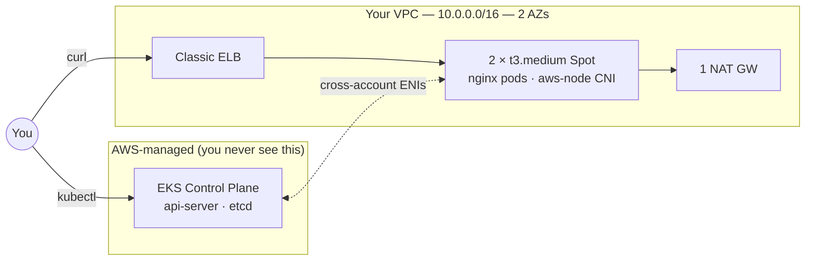

# Day 01 — EKS Cluster Setup

Provision a real EKS cluster **declaratively**, deploy nginx behind an ELB, tear it down. The repo ships a dev/sandbox variant anyone can reproduce cheaply; a production-grade variant is documented for local-only use.

**Time:** ~75 min &nbsp;|&nbsp; **Cost (dev path):** ~$0.30 if cleaned up same day

---

## Architecture (dev path)



---

## Design choices — dev vs production

The repo's YAML uses the **dev** column. The "Going Production" section below shows the diff.

| Dimension | Dev (this YAML, ~$0.30/day) | Production (local prod YAML, ~$2.50/day) |
|---|---|---|
| API endpoint | Public + Private | same; optionally CIDR-locked or private-only |
| AZ + NAT | 2 AZs, 1 NAT GW | 3 AZs, 1 NAT per AZ (`HighlyAvailable`) |
| Worker nodegroup | 1 NG, t3.medium Spot, 2 nodes | 1 NG, t3.medium Spot, 3 nodes (1/AZ) |
| Control-plane logs | audit + authenticator | all 5 (api, audit, authenticator, controllerManager, scheduler) |
| Secrets encryption | Default disk only | Customer-managed KMS CMK envelope encryption |
| Access management | `CONFIG_MAP` (legacy aws-auth) | `API_AND_CONFIG_MAP` (modern Access Entries + legacy) |

---

## Files

| File | Purpose | In git? |
|---|---|---|
| `eksctl-cluster.yaml` | Declarative cluster def — DEV variant | yes |
| `nginx-demo.yaml` | Deployment (2 replicas) + LoadBalancer Service | yes |
| `eksctl-cluster.prod.yaml` | Declarative cluster def — PROD variant | **no (gitignored)** |

---

## Implementation (dev path)

### Step 1 — Refresh AWS credentials

```bash
aws sts get-caller-identity        # must show sandbox account
aws configure get region           # should print us-west-2
```

### Step 2 — Create the cluster (~15 min for dev topology)

```bash
cd labs/day-01-eks-cluster-setup
eksctl create cluster -f eksctl-cluster.yaml
```

`eksctl` is a **CloudFormation orchestrator** — when it hangs, diagnose from the CloudFormation console (find the failed event, root-cause), not from the eksctl CLI.

### Step 3 — Verify the cluster

```bash
kubectl config current-context           # ends with @practice-cluster.us-west-2.eksctl.io
kubectl get nodes -o wide                # 2 Ready, spread across 2 AZs
kubectl -n kube-system get pods          # coredns, aws-node, kube-proxy all Running

eksctl get cluster -r us-west-2          # ACTIVE
aws iam list-open-id-connect-providers   # OIDC provider exists → IRSA ready

aws eks describe-cluster --name practice-cluster --region us-west-2 \
  --query "cluster.logging.clusterLogging"
```

### Step 4 — Deploy the demo workload

```bash
kubectl apply -f nginx-demo.yaml
kubectl get deploy,svc,pods -l app=web
kubectl get svc web -w                   # wait for EXTERNAL-IP (~90–120 s)
```

### Step 5 — Hit the LoadBalancer

```bash
ELB=$(kubectl get svc web -o jsonpath='{.status.loadBalancer.ingress[0].hostname}')
curl -sS "http://${ELB}/" | head -5      # nginx welcome HTML
```

### Step 6 — Teardown

Order matters: delete the LoadBalancer Service first so AWS releases the ELB cleanly before `eksctl` tears down the VPC. Then delete the cluster.

```bash
kubectl delete -f nginx-demo.yaml --ignore-not-found
sleep 30
eksctl delete cluster --name practice-cluster --region us-west-2 --wait
```

Sanity check — no `eksctl-practice-cluster-*` CloudFormation stacks should remain:

```bash
aws cloudformation list-stacks --region us-west-2 \
  --stack-status-filter CREATE_COMPLETE UPDATE_COMPLETE DELETE_FAILED \
  --query "StackSummaries[?starts_with(StackName,'eksctl-practice-cluster')].StackName" \
  --output text
```

If you ran the prod path, also schedule the CMK for deletion — see "Going Production" below.

---

## Going Production

To run the prod-grade variant locally:

1. Use `eksctl-cluster.prod.yaml` (gitignored). Recreate it locally from the YAML below OR copy `eksctl-cluster.yaml` and apply the diff in the design-choices table.
2. **Pre-step** — create a customer-managed KMS key (EKS rejects AWS-managed keys for envelope encryption):
   ```bash
   KMS_ARN=$(aws kms create-key \
     --description "EKS Secrets envelope encryption for practice-cluster" \
     --tags TagKey=Owner,TagValue=shubham TagKey=AutoDelete,TagValue=true \
     --query 'KeyMetadata.Arn' --output text)
   aws kms create-alias \
     --alias-name alias/eks-practice-cluster --target-key-id "$KMS_ARN"
   sed -i '' "s|REPLACE_WITH_KMS_KEY_ARN|$KMS_ARN|" eksctl-cluster.prod.yaml
   ```
3. Apply:
   ```bash
   eksctl create cluster -f eksctl-cluster.prod.yaml
   ```
4. After teardown, schedule the CMK for deletion (7-day grace period — reversible until then):
   ```bash
   aws kms delete-alias --alias-name alias/eks-practice-cluster --region us-west-2
   aws kms schedule-key-deletion --key-id "$KMS_ARN" --pending-window-in-days 7 --region us-west-2
   ```

---

## Common gotchas

| Symptom | Fix |
|---|---|
| `eksctl` fails: `secretsEncryption.keyARN: REPLACE_WITH_KMS_KEY_ARN` | (prod path only) You skipped the KMS pre-step. Run the create + sed-patch block. |
| `eksctl` fails: `AccessDeniedException: cannot create grant on AWS managed key` | (prod path only) You pointed `secretsEncryption.keyARN` at an AWS-managed key (e.g. `alias/aws/eks`). EKS only accepts customer-managed keys. |
| `eksctl` hangs at "waiting for control plane" | Service quota: EIPs, VPCs, NAT GWs per region |
| Nodes stuck `NotReady` | Almost always `aws-node` CNI: `kubectl -n kube-system logs ds/aws-node` |
| Service `EXTERNAL-IP` stuck `<pending>` >5 min | Public subnets missing `kubernetes.io/role/elb=1` (eksctl sets this; BYO VPCs miss it) |
| `kubectl` returns `Unauthorized` | Dev path: `eksctl create iamidentitymapping --cluster practice-cluster --arn <your-arn> --group system:masters`. Prod path: `aws eks create-access-entry --cluster-name practice-cluster --principal-arn <your-arn>`. |

---

## Interview Q&A

### Q1. What does `eksctl create cluster` actually do under the hood?

`eksctl` is a CloudFormation orchestrator. It generates and applies stacks in order:

1. **Cluster stack** — VPC, subnets, IGW, NAT GW(s), route tables, cluster IAM role, cluster SG, and the EKS control plane itself.
2. **Nodegroup stack(s)** — node IAM role, instance profile, Launch Template, Auto Scaling Group, node SG.
3. **Add-on stacks** — `vpc-cni`, `coredns`, `kube-proxy`, `eks-pod-identity-agent`.

When `eksctl` hangs, diagnose from the CFN console — find the failed event, root-cause (usually a service quota, invalid CIDR, or missing IAM permission).

### Q2. Control plane vs data plane — what's the difference?

- **Control plane** — AWS-managed (api-server, etcd, scheduler, controller-manager). Runs in an AWS-owned VPC. $0.10/hr; you never see the EC2s.
- **Data plane** — your nodes, in your VPC, running your pods.

They communicate over **cross-account ENIs** — AWS injects ENIs into your subnets that the control plane uses to reach kubelets. Key property: **the data plane survives control plane outages** — existing pods keep serving traffic even when the API server is unreachable.

### Q3. How does authentication to an EKS cluster work?

Two layers:

1. **AuthN (who are you?)** — IAM. `kubectl` calls `aws eks get-token`, which returns a pre-signed STS `GetCallerIdentity` URL. The api-server validates it against IAM.
2. **AuthZ (what can you do?)** — historically the `aws-auth` ConfigMap maps IAM ARNs → Kubernetes groups → RBAC bindings.

The #1 `Unauthorized` cause: the cluster creator is in `aws-auth` automatically, but other identities need to be added.

Modern alternative: **EKS Access Entries** (2024) — managed API, no ConfigMap mutation. The prod variant of this cluster uses `authenticationMode: API_AND_CONFIG_MAP` (both modes); the dev variant uses `CONFIG_MAP` only.

### Q4. How do pods get IP addresses in EKS?

The **VPC CNI plugin** (`aws-node` DaemonSet). Each node has primary + secondary ENIs; each ENI carries a pool of secondary IPs from the VPC CIDR. When a pod starts, the CNI allocates one IP to the pod's network namespace.

Implications:
- Pods get **real VPC IPs** — security groups apply, no NAT inside the VPC, direct routes to RDS/Lambda.
- IP density is bounded by `ENIs × IPs-per-ENI` (varies by instance type).
- Subnet CIDRs must be sized for pods, not just nodes — easy to exhaust in a `/24`.

For large clusters, enable **prefix delegation** — without it, an `m5.large` only gets ~29 pod IPs.

### Q5. Managed vs self-managed vs Fargate nodegroups — when to use each?

| Type | Use when | Trade-off |
|---|---|---|
| **Managed** | Default. Long-lived workloads. | AWS handles AMI patching, kubelet upgrades, graceful drain. |
| **Self-managed** | Custom AMIs, GPU, exotic networking, or Spot+OnDemand within one NG. | You own upgrade choreography, ASG hooks, drain logic. |
| **Fargate** | Bursty / per-request workloads. Compliance ("no shared kernel"). | No DaemonSets, no privileged containers, slower cold-start, no GPUs. |

This lab uses a single managed nodegroup with a single instance type (t3.medium Spot). Production patterns: diversify instance types for deeper Spot-pool resilience, or use Karpenter for elastic price/perf optimisation. True Spot+OnDemand mix within one NG requires either two managed NGs (one OnDemand baseline + one Spot burst) or Karpenter.

### Q6. What is IRSA and why does it matter?

**IAM Roles for Service Accounts** — the mechanism for giving a *pod* (not a node) AWS permissions.

How:
1. Cluster has an OIDC identity provider registered with IAM (`withOIDC: true`).
2. IAM role's trust policy allows a specific Kubernetes ServiceAccount via OIDC subject claim.
3. ServiceAccount annotated: `eks.amazonaws.com/role-arn: arn:aws:iam::...`.
4. Pod process gets temp creds via the SDK credential chain — no static keys, no node-role inheritance.

Without IRSA, the only way to give pods AWS perms is the node instance role — which means **every pod on that node** inherits them. Violates least privilege at the pod level. IRSA is non-negotiable for real clusters.

Newer alternative: **EKS Pod Identity** (2023) — same goal, no OIDC dependency, configured via EKS API instead of IAM trust policies. This cluster installs the `eks-pod-identity-agent` add-on so both mechanisms work.

### Q7. What's a `LoadBalancer` Service actually doing?

The cloud-provider (in-tree or AWS Load Balancer Controller) sees the `LoadBalancer` Service and:
1. Creates an ELB — Classic by default; NLB via `service.beta.kubernetes.io/aws-load-balancer-type: nlb`.
2. Registers nodes (or pod IPs in `nlb-ip` mode) as targets.
3. Updates `status.loadBalancer.ingress[]` with the ELB DNS.
4. `kube-proxy` programs iptables/IPVS so Service-IP traffic DNATs to a healthy pod.

Production: install **AWS Load Balancer Controller**, use NLB with `target-type: ip` — traffic goes pod-direct (skips kube-proxy hop), real client IPs preserved, SGs attached to the LB.

### Q8. How do you upgrade an EKS cluster?

Strict order:
1. **Control plane** — `eksctl upgrade cluster`. One minor version at a time (1.29 → 1.30, never 1.29 → 1.31).
2. **Add-ons** — `coredns`, `vpc-cni`, `kube-proxy` aligned to the new K8s version.
3. **Node groups** — `eksctl upgrade nodegroup`. Rolling replacement, respects PodDisruptionBudgets.
4. **Workloads** — fix deprecated APIs *before* upgrade (`pluto`, `kubent`).

Common gotcha: a PDB with `minAvailable: 100%` blocks rolling node replacement forever. Audit PDBs cluster-wide before upgrading.

### Q9. The control plane suddenly becomes unreachable. Walk through diagnosis.

1. **Confirm scope** — just my kubectl, or all clients? `aws eks describe-cluster` hits the EKS *management* API, not the cluster; if that works, the cluster object exists.
2. **Confirm impact** — are existing pods still serving? `curl` the ELB. Critical: data plane survives control plane outages.
3. **Network path** — control plane → workers goes over cross-account ENIs in your subnets. Check cluster SG (allows 443 from worker SG?), subnet NACLs, route tables.
4. **What changed?** CloudTrail for `ModifyVpcAttribute`, `AuthorizeSecurityGroupIngress`, `RevokeSecurityGroupIngress` in the last 24h.
5. **Fix + monitor** — restore network path, then add monitoring on cluster endpoint health and ENI status so you catch it before users do.

### Q10. Why use `eksctl` config files instead of CLI flags?

Three reasons, all about treating cluster definitions as code:
- **Reproducibility** — anyone recreates the exact cluster from one file in git.
- **Code review** — cluster mutations become PRs.
- **Drift detection** — `eksctl get cluster -f file.yaml` diffs intended vs actual.

CLI flags are fine for one-off experiments; never for shared environments.

### Q11. EKS encryption at rest — what are the layers, and why a customer-managed key for prod?

Two distinct layers:

**Layer 1 — disk encryption (always on, AWS-managed):** The etcd volume backing your cluster is encrypted with AWS-managed keys by default. Protects against physical disk theft. The dev variant of this cluster relies on this layer only.

**Layer 2 — envelope encryption on Kubernetes Secrets (opt-in):** Each Secret object in etcd is wrapped with a per-cluster DEK that's encrypted by a KMS key you specify. EKS only accepts a **customer-managed key** here — pointing at `alias/aws/eks` fails with `AccessDeniedException: cannot create grant on AWS managed key`. The prod variant of this cluster uses a CMK.

Why a CMK matters in prod:
- **Rotation control** — you own the schedule (annual minimum).
- **Audit trail** — every Decrypt call appears in CloudTrail with the IAM principal.
- **Blast-radius scoping** — revoke the key and every cluster Secret becomes unreadable — a clean break-glass for a compromised cluster.

Required by SOC2 CC6.1, FedRAMP, and most enterprise compliance.

### Q12. What does HA look like, and what does "cheap" cost you?

**Cheap (dev variant):** Single NAT GW (single-AZ failure domain), 2 AZs, Spot-only single instance type, minimal logging.

**This cluster's prod variant:** 3 AZs, 1 NAT per AZ, all 5 control-plane log streams, CMK envelope encryption on Secrets, modern + legacy access modes.

**True production-prod:** Above + Spot-pool diversification (multi-instance-type or Karpenter), control-plane endpoint locked to bastion CIDRs (or fully private), PDBs on every workload (`minAvailable: replicas - 1`), node-local DNS cache, Container Insights for pod-level metrics.

Rule: optimize for cost in non-prod, optimize for blast-radius in prod.

---

## Done when

- [ ] `eksctl get cluster -r us-west-2` shows cluster ACTIVE
- [ ] `kubectl get nodes` returns 2 Ready (dev) or 3 Ready (prod)
- [ ] `curl http://<elb-dns>/` returns the nginx welcome page
- [ ] Can explain (verbally) what `eksctl` did, what cross-account ENIs are, how pods get VPC IPs, and the dev/prod diff above
- [ ] Cluster destroyed; `eksctl get cluster -r us-west-2` returns empty
