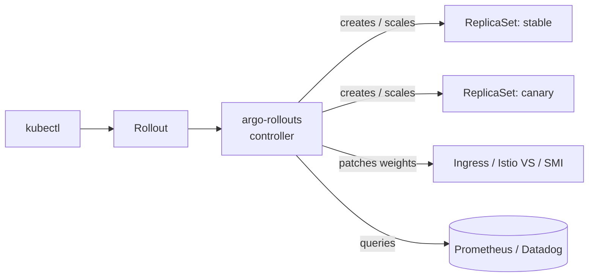

# Day 02 — Install Argo Rollouts on EKS

Install the controller + CRDs + `kubectl` plugin. No Rollout YAML yet — that's Day 3.

**Time:** ~10 min &nbsp;|&nbsp; **Cost:** $0 (rides on Day-01 cluster)

---

## Why

Vanilla `Deployment` does rolling-update only — no traffic shaping, no auto-rollback on metrics, no blue-green. Argo Rollouts replaces `Deployment` with a `Rollout` CRD that adds canary, blue-green, analysis-based promotion, and pause-for-approval steps.



---

## Install

```bash
kubectl create namespace argo-rollouts
kubectl apply -n argo-rollouts \
  -f https://github.com/argoproj/argo-rollouts/releases/latest/download/install.yaml
kubectl -n argo-rollouts wait --for=condition=Available deploy/argo-rollouts --timeout=120s
```

### kubectl plugin (Apple Silicon)

```bash
mkdir -p ~/.local/bin
curl -sSL -o ~/.local/bin/kubectl-argo-rollouts \
  https://github.com/argoproj/argo-rollouts/releases/latest/download/kubectl-argo-rollouts-darwin-arm64
chmod +x ~/.local/bin/kubectl-argo-rollouts
```

(Intel Mac → `darwin-amd64`; Linux → `linux-amd64`)

---

## Verify

```bash
kubectl -n argo-rollouts get deploy argo-rollouts
kubectl api-resources --api-group=argoproj.io        # 5 CRDs: ro, ar, at, cat, exp
kubectl argo rollouts version                        # v1.9.0+
kubectl -n argo-rollouts get leases                  # leader-election lock
```

---

## What got installed

| Object | Scope | Purpose |
|---|---|---|
| `Deployment/argo-rollouts` | namespace | the controller (1 replica + leader election) |
| `Service/argo-rollouts-metrics:8090` | namespace | Prometheus scrape endpoint |
| `ConfigMap/argo-rollouts-config` | namespace | runtime config (empty by default) |
| `ServiceAccount/argo-rollouts` | namespace | controller identity |
| `ClusterRole/argo-rollouts` + binding | cluster | controller's permissions |
| 3 `aggregate-to-{admin,edit,view}` ClusterRoles | cluster | grants Rollout CRUD to anyone with the built-in admin/edit/view roles |
| 5 CRDs: `Rollout`, `AnalysisTemplate`, `ClusterAnalysisTemplate`, `AnalysisRun`, `Experiment` | cluster | the API surface |

### Controller blast radius

The `ClusterRole/argo-rollouts` grants the controller cluster-wide access to: ReplicaSets, Services, Ingresses, Secrets, ConfigMaps, Pod eviction, Jobs, plus *every* major service-mesh / ingress-controller CRD (Istio, Linkerd-SMI, Ambassador, AppMesh, Traefik, APISIX, AWS ALB TargetGroupBindings). Inspect it:

```bash
kubectl get clusterrole argo-rollouts -o yaml
```

For prod hardening: scope to specific namespaces with a `RoleBinding`, and strip rules for traffic routers you don't use.

---

## HA

Default is 1 replica. For prod:

```bash
kubectl -n argo-rollouts scale deploy argo-rollouts --replicas=2
```

Leader election is built in via `coordination.k8s.io/leases` — only the leader is active, standby takes over within ~15s of lease lapse.

---

## Interview Q&A

**Q1. What does the Rollout controller do that the Deployment controller doesn't?**
Traffic split independent of pod counts (via Service/Ingress/mesh weights), automated analysis against metric backends with auto-abort, blue-green with a separate preview Service, and manual pause-for-approval steps.

**Q2. How does traffic shifting actually work?**
Two modes. (a) Replica ratio — controller scales canary vs stable to approximate the target weight; Service still random-routes (~accurate above 10% canary). (b) Weighted routing — controller patches Istio `VirtualService`, SMI `TrafficSplit`, Ingress annotations, or ALB target-group weights for exact percentages regardless of replica counts. Mode (b) is what you want in prod.

**Q3. What if the controller goes down?**
In-flight Rollouts pause indefinitely. Existing pods keep serving. Run replicas=2 with leader election; standby takes the lease within ~15s.

---

## Done when

- [ ] `kubectl -n argo-rollouts get deploy argo-rollouts` → `1/1` Available
- [ ] `kubectl api-resources --api-group=argoproj.io` → 5 CRDs
- [ ] `kubectl argo rollouts version` returns a version
- [ ] Cluster left running for Day 3 (canary deploy)
