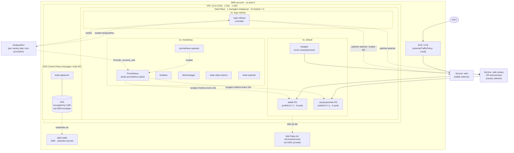

# Week 01 — Consolidation: Progressive Delivery on EKS

This isn't a new lab — it's the **single artifact** that ties Days 01-05 together.
Use it to: (a) read before an interview, (b) replay end-to-end from scratch via
`replay.sh` for muscle memory, (c) tear everything down via `teardown.sh` when done.

---

## What we built in Week 1

A progressively-delivered Go service (`podinfo`) running on an EKS cluster, with
**three increasingly automated control loops** in front of every deploy:

| control loop          | who decides? | what it watches                       | lab    |
|-----------------------|--------------|---------------------------------------|--------|
| manual canary         | human        | nothing (eyes, Slack)                 | Day 03 |
| analysis-driven canary| controller   | Prometheus PromQL on canary pods      | Day 04 |
| blue-green w/ analysis| controller   | Prometheus PromQL on the green RS     | Day 05 |

Same workload, same Service, same ELB hostname across all three. Only the
`Rollout.spec.strategy` block changes.

---

## Architecture (the whole picture, one diagram)



---

## Three control loops, side-by-side

```text
┌──────────────────────────────────────────────────────────────────────────┐
│ Day 03 — manual canary                                                   │
│                                                                          │
│   set image → 25% → pause: {} ─── human eyeballs Grafana ─── promote     │
│                                                                          │
│   knobs: replicas, setWeight per step, manual gates                      │
│   abort: kubectl argo rollouts abort + undo                              │
└──────────────────────────────────────────────────────────────────────────┘

┌──────────────────────────────────────────────────────────────────────────┐
│ Day 04 — analysis-driven canary                                          │
│                                                                          │
│   set image → 25% → pause: 45s ─── AnalysisRun ─── Prometheus PromQL     │
│                                                          ▼               │
│                                              success_rate ≥ 0.95?        │
│                                              ├─ yes → next step          │
│                                              └─ no  → abort, RS → 0      │
│                                                                          │
│   knobs: interval, count, failureLimit, threshold                        │
│   abort: automatic on failureLimit exceeded                              │
└──────────────────────────────────────────────────────────────────────────┘

┌──────────────────────────────────────────────────────────────────────────┐
│ Day 05 — blue-green with prePromotionAnalysis                            │
│                                                                          │
│   set image → spin green at FULL SIZE (2× compute window)                │
│            → AnalysisRun against green-only via web-preview              │
│            → success → flip activeService.selector to green hash         │
│              (single atomic patch, sub-second user cutover)              │
│            → blue stays at full size for scaleDownDelaySeconds (60s)     │
│              (rollback within window = another selector flip, instant)   │
│                                                                          │
│   knobs: autoPromotionEnabled, scaleDownDelaySeconds, abortScaleDown..   │
│   abort: automatic; old blue still warm → rollback is instant            │
└──────────────────────────────────────────────────────────────────────────┘
```

---

## Files in this lab

| file           | purpose                                                          |
|----------------|------------------------------------------------------------------|
| `README.md`    | this artifact — architecture, narrative, interview prep          |
| `replay.sh`    | end-to-end script: fresh cluster → Day 1..5 in ~45 min           |
| `teardown.sh`  | one-shot cleanup: helm uninstall, delete cluster, schedule KMS deletion |

---

## How to use this lab

**Read-only mode** (5 min before an interview): just read this README plus the
per-day Q&A sections. The 60-second narrative below is what you'd open with.

**Muscle-memory mode** (~60 min, costs ~$1 in cluster time):
```bash
./replay.sh         # rebuild Day 1..5 from a cluster-less start
                    # → Day-5 BG demo ready to drive
./teardown.sh       # delete cluster + helm releases + schedule KMS deletion
```

---

## The 60-second narrative (interview opener)

> "I spent week one of my deep-dive building a progressive-delivery platform on
> EKS, exactly the kind of thing I'd want to roll out at a new org. The cluster
> is provisioned via declarative `eksctl` config — two AZs and a single NAT for
> the dev path, three AZs and HA NATs in the prod variant; secrets at rest are
> envelope-encrypted with a customer-managed KMS key, IRSA is wired via the
> OIDC provider, and access is via EKS Access Entries rather than the legacy
> aws-auth ConfigMap.
>
> On top of that I installed Argo Rollouts and built three control loops
> against the same nginx → podinfo workload: a manual canary with explicit
> promote gates; an analysis-driven canary where a Prometheus PromQL query
> against the canary pods auto-decides per step; and a blue-green where a
> `prePromotionAnalysis` gates the atomic Service-selector flip. The blue-green
> keeps the old replica set warm for sixty seconds so rollback within the
> window is just another selector patch — sub-second user cutover.
>
> Along the way I hit three real failure modes that are exactly the kind of
> thing that bites in production — a named-port mismatch that left
> `Endpoints` empty and every CLB target out-of-service, the fact that AWS
> security groups are stateful so revoking a rule doesn't kill established
> connections, and that Argo treats any pod-template change as a new revision
> which can surprise you mid-rollout. Each one is documented in the per-day
> README with the symptom, root cause, and fix."

---

## Anticipated deep-dive questions (Staff level)

**"Why did you pick the analysis-driven canary over plain blue-green?"**
Different tools for different risk profiles. Canary is for changes where partial
user exposure is *acceptable and informative* — you actually want production
traffic on the new code to find the bugs that synthetic tests miss. Blue-green
is for all-or-nothing changes where partial exposure is *unacceptable* (API
breaking changes, schema migrations, dependency upgrades that change wire
format). Mature pipelines have both available and pick per change-type at the
PR level.

**"What's the cardinality cost of your PromQL query?"**
`sum(rate(http_requests_total{namespace="default", pod=~"web-<hash>-.+", status!~"5.."}[1m]))` — the pod regex is the high-cardinality risk. Each unique
pod IP × status code × method is a series. With ~10 pods and 6 common status
codes that's ~60 series per workload, well within a single Prometheus replica's
budget. At org scale you'd either (a) push selection into recording rules,
(b) use `topk` or label aggregation to bound the result, (c) shard Prometheus
by workload.

**"How does Argo know which pods are canary?"**
The Rollout controller stamps every pod template with a `rollouts-pod-template-hash`
label. The ReplicaSet inherits it; pods inherit it from the RS. Argo writes
that hash into the `canaryService` (or `previewService`) selector and into
`stableService`. From there, Endpoints/EndpointSlices route automatically.
Inside the AnalysisTemplate we get the canary hash via
`valueFrom.podTemplateHashValue: Latest`, then filter PromQL with
`pod=~"web-{{args.pod-hash}}-.+"`.

**"What happens if Prometheus is down when the AnalysisRun fires?"**
The prometheus provider gets connection-refused → metric goes `Error` →
controller treats `Error` like `Failed` by default. Practical outcomes: bad
image during outage → still aborts (safe). Good image during outage → also
aborts (false negative, no harm done — the deploy just doesn't happen).
Mitigations: Prometheus replicas ≥ 2 + a separate Alertmanager, add a
fallback `web` provider in the AnalysisTemplate as a smoke test, or set
`failureLimit` high enough that one transient Prometheus blip doesn't kill
the deploy.

**"You're using a Classic ELB. Why does the new-pod flip take ~60s to visible-to-users?"**
`externalTrafficPolicy: Local` + CLB means the LB targets the *node port* on
every node, but each node only forwards to a *local pod*. After the selector
flip, the new green pods are on a different set of nodes than the blue pods
were. CLB's HealthyThreshold has to fire enough successful checks against
each new node's healthCheckNodePort (default 30s × N=3-10 checks) before
marking it InService. During the gap, ELB users see "(52) empty reply from
server". The flip is atomic *inside* the cluster (kube-proxy iptables
re-program instantly); the CLB just lags. Mitigation: NLB instead of CLB
(target-based, faster), or external-DNS swap (DNS TTL allows instant cut),
or service-mesh weighted routing where you control the data plane directly.

**"If you were doing this for real, what would you change?"**
A few things:
1. **Service mesh** (Linkerd or Istio) instead of replica-weighted canary —
   gives you true 1% canary instead of the math-rounded "1 pod = 25% with
   4 replicas" we have today.
2. **Promotion gating via Slack + a `prePromotionAnalysis` + Datadog query**
   so the human gate and the metric gate are on the same rollout.
3. **Argo CD layered on top** so the Rollout YAMLs are the desired state in
   Git, not `kubectl apply` from a workstation — the Day 11 lab.
4. **Multi-cluster active/active** with a separate AnalysisTemplate that
   queries error rate *across* clusters before promoting, so a regional
   failure doesn't get masked by an aggregated metric.
5. **SLO-based abort** — instead of "success rate < 0.95", abort if the
   canary burns more than X% of the error budget per hour. Day 19.

---

## Lessons learned the hard way (from doing it)

These are the actual war stories — far more interview-credible than the happy
path. Each one is documented in detail in the linked per-day README.

| problem                                                | root cause                                                                                              | day |
|--------------------------------------------------------|---------------------------------------------------------------------------------------------------------|-----|
| `Endpoints: <none>` despite Ready pods → every CLB target OutOfService → in-cluster `curl http://web/` exits 7 | Service `targetPort: http` (named) + Rollout container `containerPort: 80` *without* `name: http` → named-port lookup fails | [Day 03](../day-03-canary-manual/README.md) |
| Worker nodes stayed `Ready` after I revoked the SG ingress rule that kubelet needs | AWS security groups are **stateful** — revoking blocks *new* connections; existing kubelet watch survives lease renewals | [Day 01](../day-01-eks-cluster-setup/README.md) |
| Argo started a canary I didn't ask for after I just edited the Rollout YAML | Any `spec.template` change (port name, env, label) creates a new revision and walks every canary step | [Day 03](../day-03-canary-manual/README.md) |
| After deleting+recreating the Deployment, ELB returned `(52) empty reply` for ~60s | `externalTrafficPolicy: Local` + CLB needs HealthyThreshold consecutive checks before a new node set is InService | [Day 03](../day-03-canary-manual/README.md) |
| PodMonitor exists but Prometheus scrapes nothing | Default kube-prometheus-stack selector requires `release: kps` label; without `podMonitorSelectorNilUsesHelmValues=false` you must label every monitor | [Day 04](../day-04-analysis-auto-canary/README.md) |

---

## Per-day jump links

- **[Day 01](../day-01-eks-cluster-setup/)** — EKS via eksctl (dev + prod), KMS-encrypted secrets, IRSA, Access Entries
- **[Day 02](../day-02-argo-rollouts-install/)** — Argo Rollouts controller + CRDs + RBAC blast radius
- **[Day 03](../day-03-canary-manual/)** — Canary with manual promotion + abort/undo
- **[Day 04](../day-04-analysis-auto-canary/)** — Canary with Prometheus AnalysisTemplate (auto-promote / auto-abort)
- **[Day 05](../day-05-blue-green/)** — Blue-Green (manual + analysis-gated variants)
